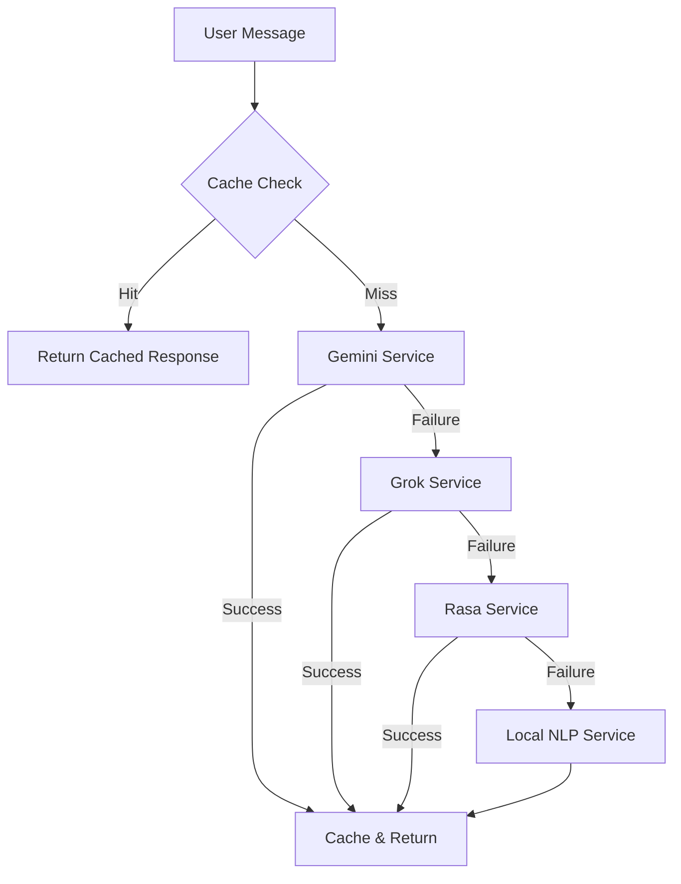

# Design Document: Grok API Fallback Integration

## Overview

This design document specifies the technical architecture for integrating xAI's Grok API as an intelligent fallback tier in the Ayurva medical chatbot system. The system currently uses a 3-tier fallback chain (Gemini → Rasa → Local NLP), which will be enhanced to a 4-tier chain (Gemini → Grok → Rasa → Local NLP).

### Problem Statement

The current system experiences degraded user experience when the primary Gemini API fails due to quota limits, network issues, or service unavailability. Users receive either structured but less intelligent Rasa responses or basic keyword-based responses from the local NLP service. This gap in intelligent AI responses reduces the quality of medical advice during Gemini outages.

### Solution Approach

Integrate Grok API as a secondary AI-powered fallback tier that:
- Provides intelligent, context-aware medical responses when Gemini fails
- Maintains medical safety standards with appropriate disclaimers
- Seamlessly integrates into the existing fallback chain
- Supports both WhatsApp and web chat interfaces
- Leverages response caching for performance optimization

### Key Benefits

1. **Improved Reliability**: Dual AI-powered tiers reduce single-point-of-failure risk
2. **Maintained Intelligence**: Users receive AI-generated responses even during Gemini outages
3. **Medical Safety**: Consistent medical disclaimers and safety rules across both AI services
4. **Performance**: Response caching minimizes API calls and improves response times
5. **Seamless Integration**: Existing code structure requires minimal changes

## Architecture

### System Components



### Component Responsibilities

#### 1. Grok Service (`backend/services/grok-service.js`)
- Initialize Grok API client with configuration
- Process user messages through Grok API
- Apply medical context and safety rules
- Format responses with medical disclaimers
- Handle API errors and trigger fallback chain
- Enforce timeout and token limits

#### 2. Cache Service (`backend/services/cache-service.js`)
- Store responses from all services (existing functionality)
- Retrieve cached responses before invoking fallback chain
- Normalize queries for consistent cache keys
- Track cache statistics (hits, misses, hit rate)

#### 3. Route Handlers
- **WhatsApp Webhook** (`backend/routes/whatsappWebhook.js`): Process WhatsApp messages through fallback chain
- **Chat Routes** (`backend/routes/chatRoutes.js`): Process web chat messages through fallback chain

### Fallback Chain Logic

The system attempts services in sequential order, moving to the next tier only on failure:

1. **Cache Check**: Return immediately if response exists
2. **Tier 1 - Gemini**: Primary AI service (existing)
3. **Tier 2 - Grok**: Secondary AI service (new)
4. **Tier 3 - Rasa**: Structured intent-based responses (existing)
5. **Tier 4 - Local NLP**: Keyword-based pattern matching (existing)

Each tier throws an error on failure to trigger the next tier. The chain completes when any tier succeeds or all tiers fail.

## Components and Interfaces

### Grok Service Interface

```javascript
class GrokService {
  constructor()
  async init()
  async processMessage(input: string): Promise<string>
}
```

**Methods:**

- `constructor()`: Initialize service with configuration from environment variables
- `init()`: Validate API key and prepare client (called lazily on first use)
- `processMessage(input)`: Process user message and return AI response with disclaimer

**Configuration:**
- `GROK_API_KEY`: API key for xAI Grok API (required)
- `GROK_MODEL`: Model name (default: "grok-beta")
- `GROK_TIMEOUT`: Request timeout in milliseconds (default: 5000)

### API Integration

The Grok API is OpenAI-compatible, allowing use of standard HTTP REST calls:

**Endpoint:** `https://api.x.ai/v1/chat/completions`

**Request Format:**
```javascript
{
  model: "grok-beta",
  messages: [
    { role: "system", content: "<medical assistant instructions>" },
    { role: "user", content: "<user query>" }
  ],
  temperature: 0.7,
  max_tokens: 2048
}
```

**Response Format:**
```javascript
{
  choices: [
    {
      message: {
        content: "<AI response>"
      }
    }
  ]
}
```

**Error Handling:**
- 429 (Quota Exceeded): Throw error to trigger Rasa fallback
- 401 (Invalid API Key): Log error and throw exception
- Timeout: Throw error after 5 seconds
- Network errors: Throw error to trigger fallback

### Route Handler Integration

Both route handlers follow the same pattern:

```javascript
async function processMessage(userMessage, userId) {
  // 1. Check cache
  const cached = cacheService.getCachedResponse(userMessage);
  if (cached) return { response: cached, service: 'cache' };
  
  // 2. Try Gemini
  try {
    const response = await langchainService.processMessage(userMessage);
    cacheService.setCachedResponse(userMessage, response);
    return { response, service: 'gemini' };
  } catch (geminiError) {
    // 3. Try Grok
    try {
      const response = await grokService.processMessage(userMessage);
      cacheService.setCachedResponse(userMessage, response);
      return { response, service: 'grok' };
    } catch (grokError) {
      // 4. Try Rasa
      try {
        const response = await rasaService.processMessage(userMessage, userId);
        cacheService.setCachedResponse(userMessage, response);
        return { response, service: 'rasa' };
      } catch (rasaError) {
        // 5. Use Local NLP
        const response = await nlpService.processMessage(userMessage, userId);
        cacheService.setCachedResponse(userMessage, response);
        return { response, service: 'local-nlp' };
      }
    }
  }
}
```

## Data Models

### Environment Configuration

```javascript
{
  // Existing
  GOOGLE_API_KEY: string,
  RASA_URL: string,
  
  // New
  GROK_API_KEY: string,      // Required for Grok service
  GROK_MODEL: string,         // Optional, default: "grok-beta"
  GROK_TIMEOUT: number        // Optional, default: 5000
}
```

### Response Metadata

```javascript
{
  response: string,           // The actual response text
  service: string,            // 'cache' | 'gemini' | 'grok' | 'rasa' | 'local-nlp'
  cached: boolean            // true if from cache, false otherwise
}
```

### Grok API Request

```javascript
{
  model: string,              // "grok-beta" or other Grok model
  messages: Array<{
    role: 'system' | 'user' | 'assistant',
    content: string
  }>,
  temperature: number,        // 0.7 for balanced creativity
  max_tokens: number         // 2048 maximum
}
```

### Grok API Response

```javascript
{
  id: string,
  object: 'chat.completion',
  created: number,
  model: string,
  choices: Array<{
    index: number,
    message: {
      role: 'assistant',
      content: string
    },
    finish_reason: string
  }>,
  usage: {
    prompt_tokens: number,
    completion_tokens: number,
    total_tokens: number
  }
}
```

## Error Handling

### Error Categories

1. **Configuration Errors**
   - Missing GROK_API_KEY
   - Invalid API key format (< 20 characters)
   - Action: Log warning, skip Grok initialization, proceed to Rasa

2. **API Errors**
   - 401 Unauthorized: Invalid API key
   - 429 Too Many Requests: Quota exceeded
   - 500/502/503: Server errors
   - Action: Log error with context, throw exception to trigger next fallback

3. **Network Errors**
   - Connection timeout (> 5 seconds)
   - Connection refused
   - DNS resolution failure
   - Action: Log error, throw exception to trigger next fallback

4. **Response Errors**
   - Empty response from API
   - Malformed JSON response
   - Missing required fields
   - Action: Log error, throw exception to trigger next fallback

### Error Logging Format

All errors are logged with structured information:

```javascript
{
  timestamp: ISO8601,
  service: 'grok',
  error_type: string,
  error_message: string,
  user_message: string,
  stack_trace: string (if available)
}
```

### Fallback Behavior

- **Grok Service Not Initialized**: Skip Grok tier, proceed directly to Rasa
- **Grok API Failure**: Log error, attempt Rasa service
- **All Services Fail**: Return default welcome message with feature list

### Timeout Handling

- **Grok API Timeout**: 5 seconds (configurable via GROK_TIMEOUT)
- **Total Chain Timeout**: 10 seconds maximum for complete fallback chain
- **Cache Response**: < 50 milliseconds (no timeout needed)

## Testing Strategy

### Property-Based Testing Assessment

**Property-based testing is NOT applicable** for this feature because:

1. **External Service Integration**: The feature primarily integrates with external APIs (Grok, Gemini, Rasa), which are side-effect operations that cannot be tested with pure property-based approaches
2. **Orchestration Logic**: The core functionality is sequential fallback orchestration and error handling, not data transformation with universal properties
3. **Stateful Behavior**: The fallback chain depends on external service state and error conditions, which are better tested with example-based scenarios
4. **Mock-Heavy Testing**: Testing requires extensive mocking of external services, which defeats the purpose of property-based testing

**Alternative Testing Approach**: This feature will use **example-based unit tests** with mocked services and **integration tests** with real or stubbed API endpoints to verify correct fallback behavior across specific scenarios.

### Unit Tests

Unit tests will use Jest with mocked external services to verify isolated component behavior.

**Grok Service Tests** (`backend/tests/grok-service.test.js`):
1. Service initialization with valid API key
2. Service initialization with missing API key (should skip initialization)
3. Service initialization with invalid API key format (< 20 chars)
4. Successful message processing returns response with disclaimer
5. API quota error (429) throws error to trigger fallback
6. Network timeout (> 5s) throws error to trigger fallback
7. Malformed API response throws error to trigger fallback
8. Medical disclaimer correctly appended to all responses
9. System prompt includes medical safety rules

**Fallback Chain Tests** (`backend/tests/fallback-chain.test.js`):
1. Cache hit returns immediately without invoking services
2. Gemini success caches response and returns
3. Gemini failure triggers Grok attempt
4. Grok success caches response and returns
5. Grok failure triggers Rasa attempt
6. Rasa success caches response and returns
7. Rasa failure triggers Local NLP attempt
8. All services fail returns default welcome message
9. Service metadata correctly identifies response source
10. Complete chain completes within 10 seconds

**Configuration Tests** (`backend/tests/grok-config.test.js`):
1. Valid GROK_API_KEY loads successfully
2. Missing GROK_API_KEY logs warning and skips initialization
3. GROK_MODEL defaults to "grok-beta" when not set
4. GROK_TIMEOUT defaults to 5000ms when not set
5. Custom GROK_MODEL value is respected
6. Custom GROK_TIMEOUT value is respected

### Integration Tests

Integration tests will use real or stubbed API endpoints to verify end-to-end behavior.

**WhatsApp Integration** (`backend/tests/whatsapp-grok.test.js`):
1. WhatsApp message processed through Grok when Gemini fails
2. Response truncation for messages exceeding 1500 characters
3. Service metadata included in response
4. Twilio API called with correct phone number and message
5. TwiML response returned to Twilio webhook

**Web Chat Integration** (`backend/tests/chat-grok.test.js`):
1. Web message processed through Grok when Gemini fails
2. JSON response includes "service" field with correct value
3. JSON response includes "cached" boolean field
4. HTTP 200 returned for all successfully processed messages
5. HTTP 500 returned only when all services fail

**Error Handling Integration** (`backend/tests/error-handling.test.js`):
1. Quota error from Grok triggers Rasa fallback
2. Timeout error from Grok triggers Rasa fallback
3. Network error from Grok triggers Rasa fallback
4. Invalid API key error logs warning and skips Grok
5. All errors logged with correct format and context

### Manual Testing

Manual testing checklist for deployment verification:

1. **Grok API Connectivity**: Send test request to Grok API, verify successful response
2. **Fallback Trigger**: Temporarily disable Gemini, verify Grok processes request
3. **Medical Context**: Verify all Grok responses include medical disclaimers
4. **Performance**: Measure response times for each tier (target: < 5s per tier)
5. **Error Scenarios**: Test with invalid API key, network disconnection, quota exceeded
6. **WhatsApp Flow**: Send test message via WhatsApp, verify response received
7. **Web Chat Flow**: Send test message via web interface, verify JSON response
8. **Cache Behavior**: Send duplicate message, verify cached response returned instantly

### Test Data

Use existing medical test queries to ensure consistent behavior across all services:

**General Health Queries:**
- "I have a fever and headache"
- "What are symptoms of diabetes?"
- "Tell me about vaccination"
- "How can I improve my sleep?"

**Emergency Scenarios:**
- "I can't breathe"
- "Severe chest pain"
- "Heavy bleeding"

**Edge Cases:**
- "Hello" (greeting)
- "" (empty message)
- Very long message (> 1000 characters)
- Special characters and emojis

### Test Coverage Goals

- **Unit Test Coverage**: > 80% for Grok service and fallback chain logic
- **Integration Test Coverage**: All critical user paths (WhatsApp, web chat)
- **Error Path Coverage**: All error types and fallback scenarios
- **Performance Testing**: Response time verification for each tier

## Implementation Notes

### Medical Safety Rules

Both Gemini and Grok services must enforce identical medical safety rules:

```javascript
const MEDICAL_SYSTEM_PROMPT = `You are Ayurva, an advanced AI healthcare assistant.
Your goal is to provide helpful, empathetic, and medically-grounded information.

CRITICAL RULES:
1. You are NOT a doctor. Always include a disclaimer that this is for informational purposes.
2. If symptoms sound life-threatening (chest pain, severe bleeding, difficulty breathing), 
   advise emergency services immediately.
3. Never prescribe specific medication dosages.
4. Maintain an empathetic and supportive tone.
5. Provide evidence-based health information when possible.`;
```

### Response Formatting

All AI responses (Gemini and Grok) must append the medical disclaimer:

```javascript
const MEDICAL_DISCLAIMER = "\n\n*Disclaimer: I am an AI assistant, not a doctor. Consult a professional for critical health decisions.*";
```

### Performance Optimization

1. **Lazy Initialization**: Grok service initializes only on first use
2. **Connection Pooling**: Reuse HTTP connections for API requests
3. **Response Caching**: Cache all successful responses regardless of source
4. **Timeout Configuration**: Aggressive timeouts prevent blocking

### Deployment Considerations

1. **Environment Variables**: Add GROK_API_KEY to deployment environment
2. **API Key Security**: Store API key in secure environment variable, never commit to code
3. **Monitoring**: Track Grok API usage, error rates, and response times
4. **Cost Management**: Monitor Grok API costs, implement usage limits if needed
5. **Graceful Degradation**: System continues functioning if Grok is unavailable

### Migration Path

1. **Phase 1**: Implement Grok service in isolation
2. **Phase 2**: Add Grok to fallback chain with feature flag
3. **Phase 3**: Enable Grok for subset of users (A/B testing)
4. **Phase 4**: Enable Grok for all users
5. **Phase 5**: Monitor and optimize based on usage patterns

## Dependencies

### New Dependencies

None required - Grok API uses standard HTTP REST calls compatible with Node.js built-in `https` module or existing `axios` dependency.

### Existing Dependencies

- `axios`: HTTP client for API requests (already installed)
- `node-cache`: Response caching (already installed)
- `express`: Web framework for routes (already installed)
- `dotenv`: Environment variable management (already installed)

## Security Considerations

1. **API Key Protection**
   - Store in environment variables only
   - Never log API keys
   - Rotate keys periodically
   - Use separate keys for development/production

2. **Input Validation**
   - Sanitize user messages before sending to API
   - Limit message length to prevent abuse
   - Validate API responses before returning to users

3. **Rate Limiting**
   - Implement per-user rate limits
   - Track API usage to prevent quota exhaustion
   - Implement exponential backoff for retries

4. **Data Privacy**
   - Do not log sensitive medical information
   - Comply with HIPAA/GDPR requirements
   - Implement data retention policies

## Monitoring and Observability

### Metrics to Track

1. **Service Usage**
   - Requests per service (gemini, grok, rasa, local-nlp)
   - Cache hit rate
   - Average response time per service

2. **Error Rates**
   - Gemini failure rate
   - Grok failure rate
   - Rasa failure rate
   - Complete chain failure rate

3. **Performance**
   - P50, P95, P99 response times
   - Timeout occurrences
   - API latency per service

4. **Cost**
   - Grok API token usage
   - Estimated monthly cost
   - Cost per user interaction

### Logging Strategy

**Log Levels:**
- `INFO`: Service selection, successful responses
- `WARN`: Service failures, fallback triggers
- `ERROR`: Complete chain failures, configuration errors

**Log Format:**
```javascript
{
  timestamp: "2025-01-15T10:30:45.123Z",
  level: "INFO",
  service: "grok",
  action: "process_message",
  user_message: "I have a fever",
  response_length: 245,
  duration_ms: 1234
}
```

## Future Enhancements

1. **Intelligent Routing**: Route queries to optimal service based on query type
2. **Response Quality Scoring**: Track user satisfaction per service
3. **Dynamic Fallback**: Adjust fallback order based on service health
4. **Multi-Model Support**: Support multiple Grok models (grok-beta, grok-2, etc.)
5. **Streaming Responses**: Implement streaming for faster perceived response times
6. **Context Preservation**: Maintain conversation context across fallback tiers
